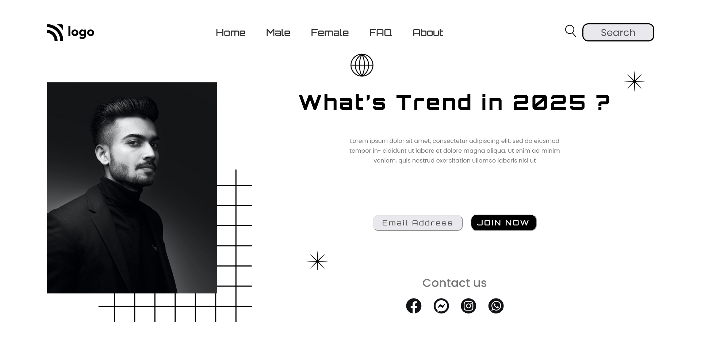

# Project - 1 Trend in 2025

This is the first mini-challenge project among the 15 Ineuron-projects.

## Table of contents

- [Overview](#overview)
  - [Screenshot](#screenshot)
  - [Links](#links)
- [My process](#my-process)
  - [Built with](#built-with)
  - [Time required](#time-required)
  - [What I learned](#continues-development)
  - [Useful resources](#useful-resources)
- [Author](#author)
- [Acknowledgments](#acknowledgments)

## Overview

### Screenshot



### Links

- Code File URL: [github.com](https://github.com/Jyotimoykathar/Project-01)
- Live Site URL: [netlify.app](https://project-01-trend2025.netlify.app/)

## My Process

### Built with

- Semantic HTML5 markup
- CSS custom properties
- Flexbox Css

### Time required

It took me nearly the hold day to place all the items in its place and complete the project.

### What I learned

This is the css design code snippet of the hero container section, through which i got more clear on attribute selector and position.

```css
[aria-label="banner"] .hero-container {
  display: flex;
  justify-content: space-between;
  gap: 1.5rem;
  position: relative;
}

.square {
  position: absolute;
  top: 40%;
  left: 8.5%;
}
.globe {
  position: absolute;
  top: -7%;
  left: 50%;
}
```

### Continued development

I have still a lot to grab on positioning elements. The design page here is static and responsiveness is still pending.

### Useful resources

- [MDN](https://developer.mozilla.org/en-US/) - This website helped me to any thing i had to look upon.

## Author

- Github page- [Jyotimoykathar](https://github.com/Jyotimoykathar/)

## Acknowledgments

Special Thanks to [MDN](https://developer.mozilla.org/en-US/) website and to all the Ineuron team for the mini-challenge to test and improve my positioning skills.
